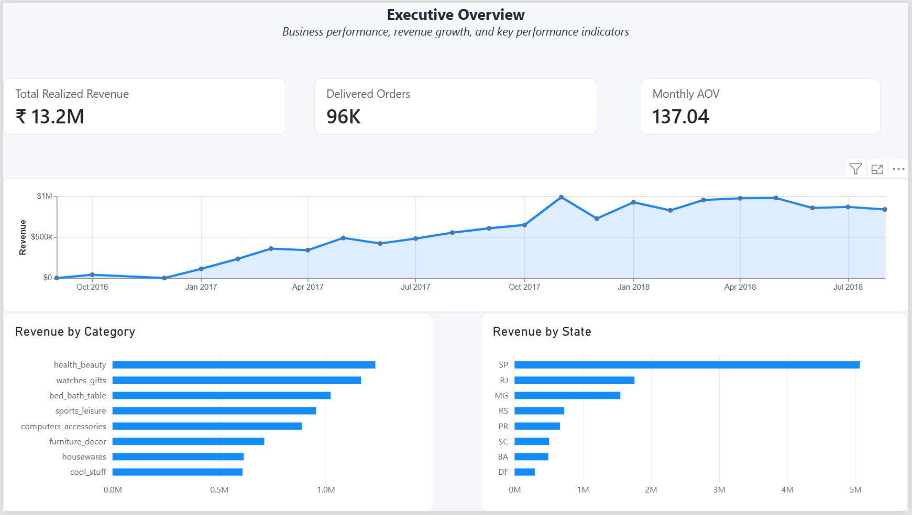
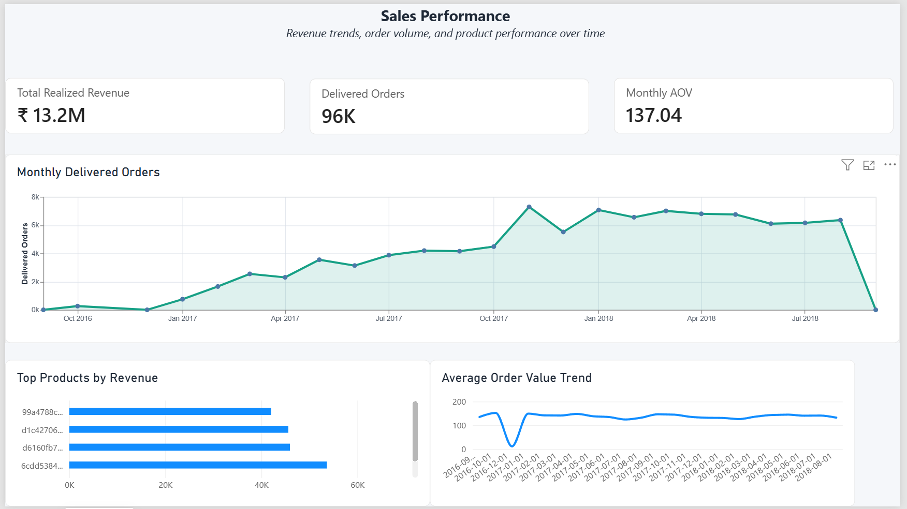
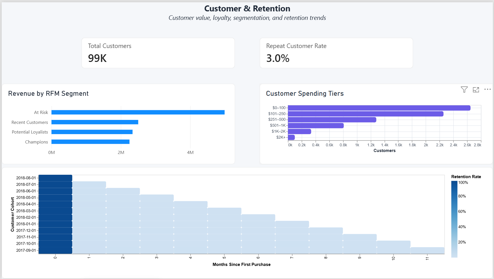
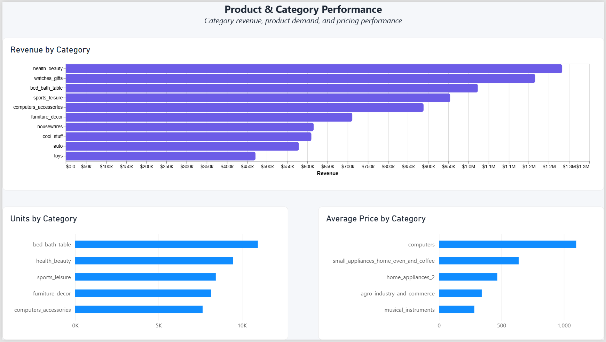
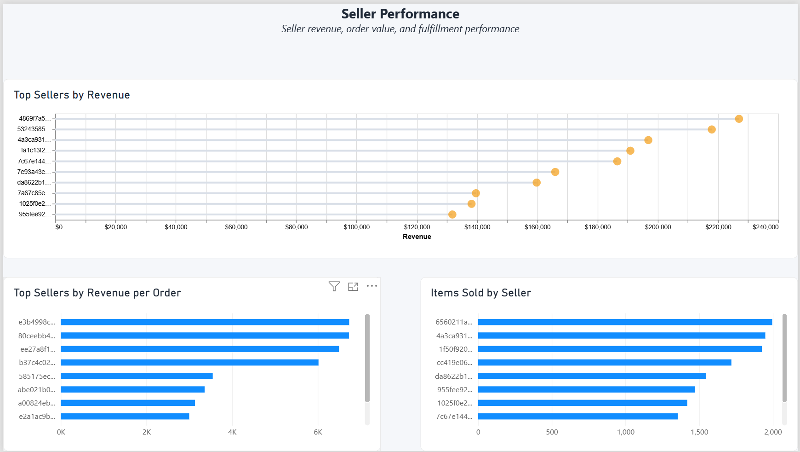
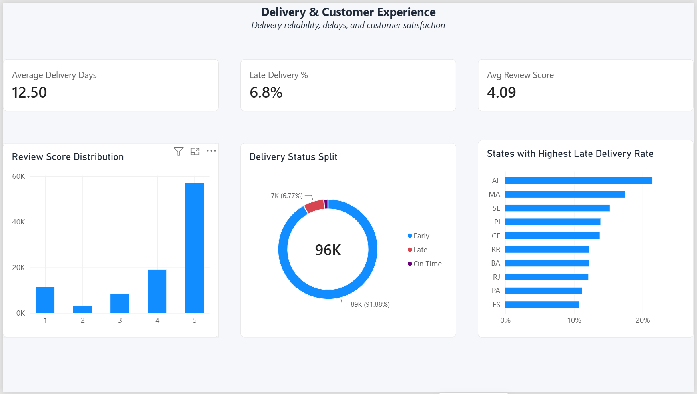

# Olist E-Commerce Analytics — Sales, Retention & Delivery Dashboard

A six-page **Power BI business intelligence dashboard** analyzing e-commerce sales, customer lifecycle behavior, product and category performance, seller contribution, fulfillment reliability, and customer experience.

This project follows a **validation-first analytics workflow**: raw data is transformed into documented MySQL analytical views, business rules are validated, and the resulting analytical layer is consumed by Power BI for interactive reporting.

---

## 📌 Project Overview

Most e-commerce dashboards reduce performance to a single revenue number. This project deliberately separates **revenue realization, order activity, customer behavior, and fulfillment outcomes** so that operational performance is not hidden inside a blended KPI.

The analysis connects:

- Sales and realized revenue
- Customer lifecycle and repeat purchasing
- RFM-based customer segmentation
- Cohort retention
- Product and category performance
- Seller-level performance diagnostics
- Delivery reliability
- Geographic delivery risk
- Customer reviews and experience

The goal is not only to make metrics visible, but to make them **defensible, traceable, and useful for business decisions**.

---

## 🎯 Business Objectives

The project is designed to answer:

- How is realized revenue performing over time?
- Is revenue movement driven by order volume, order value, or both?
- Which categories and products contribute most to realized revenue?
- Which sellers contribute the most commercial value?
- What does customer lifecycle behavior look like within the observed window?
- How strong is repeat purchasing?
- Which customer segments represent higher value?
- How does retention vary across cohorts?
- Where are delivery delays concentrated?
- How does operational reliability relate to customer reviews?

---

## 📊 Key KPIs

| KPI | Value |
|---|---:|
| **Realized Revenue** | **₹13.22M** |
| **Delivered Orders** | **96,478** |
| **Unique Customers** | **93,358** |
| **Average Order Value** | **₹137.04** |
| **Repeat Customer Rate** | **3.00%** |
| **Average Delivery Time** | **12.50 days** |
| **Late Delivery Rate** | **6.77%** |
| **Average Review Score** | **4.09 / 5** |

> **Metric definition note:** Repeat-customer analysis is treated as **window-scoped** because the dataset covers a finite historical observation period. A customer appearing once in the data is not necessarily a customer who would never repeat outside the observation window.

---

## 📊 Dashboard Preview

This project is structured across six analytical views, with each page focused on a distinct business question.

### 01 — Executive Overview
> **What is the overall health of the business?**



### 02 — Sales Analysis
> **How are revenue and order performance evolving over time?**



### 03 — Customer & Retention Analysis
> **Who are the customers, how valuable are they, and how well are they retained?**



### 04 — Product & Category Analysis
> **Which categories and products drive realized business value?**



### 05 — Seller Performance
> **Which sellers contribute most to marketplace performance?**



### 06 — Delivery & Review Analysis
> **Where does fulfillment performance intersect with customer experience?**



---

## 💡 Key Business Insights

The dashboard is designed to surface several important business patterns:

- **Customer retention is a major growth opportunity:** the observed repeat-customer rate is **3.00%**, making second-purchase conversion an important area for customer-lifecycle strategy.

- **Revenue performance requires fulfillment context:** realized revenue is evaluated separately from broader booked or unrealized commercial value, reducing the risk of presenting demand that did not become completed business as revenue.

- **Customer value is multidimensional:** RFM analysis combines recency, frequency, and monetary value instead of ranking customers using revenue alone.

- **Seller performance is uneven:** seller-level revenue, order volume, and revenue-per-order measures provide separate views of commercial contribution rather than an arbitrary composite score.

- **Delivery reliability can be diagnosed geographically:** the overall late-delivery rate is **6.77%**, while state-level analysis helps identify areas requiring deeper operational investigation.

- **Customer satisfaction provides an additional experience signal:** the overall review score is **4.09/5**, allowing delivery outcomes and customer feedback to be analyzed together.

> These observations are intentionally framed as analytical signals rather than unsupported causal claims.

---

## 🔍 Analytical Framework

### Revenue Realization

Revenue is treated as a **fulfillment-aware metric**.

The project distinguishes realized revenue from broader item-level commercial values so that cancelled, unavailable, or otherwise unrealized demand is not accidentally presented as completed revenue.

### Customer Lifecycle Segmentation

RFM analysis is used to distinguish customer behavior and value through:

- **Recency** — how recently a customer purchased
- **Frequency** — how often a customer purchased
- **Monetary value** — realized revenue generated by the customer

The methodology is adapted to the actual purchase-frequency distribution rather than blindly applying a conventional segmentation template.

### Repeat Purchase Analysis

Repeat behavior is evaluated within the available observation window.

This avoids interpreting a finite historical dataset as if it represented customers' complete lifetime purchasing history.

### Cohort Retention

Customers are grouped by first-purchase month and evaluated across subsequent months.

Retention is normalized against the original cohort size so cohorts of different sizes can be compared more fairly.

The analysis also accounts for **observation-window bias**: later cohorts have had less time to generate repeat purchases than earlier cohorts.

### Delivery Reliability

Delivery duration and estimated-versus-actual delivery dates are used to evaluate operational reliability.

Geographic analysis helps surface **delivery-risk areas** that may require operational investigation.

### Seller Performance Diagnostics

Seller performance is evaluated using independent commercial measures such as realized revenue, order volume, items delivered, and revenue-per-order.

This keeps commercial contribution separate from operational performance.

### Customer Experience

Review scores are analyzed alongside delivery performance to investigate whether operational outcomes are associated with differences in customer feedback.

---

## 🧩 Data Pipeline

```text
Source CSVs
    ↓
Raw MySQL Layer
    ↓
Data-Quality Validation
    ↓
Cleaned / Staging Layer
    ↓
Analytical SQL Views
    ↓
RFM & Cohort Retention Layer
    ↓
Power BI Data Model
    ↓
Six-Page Dashboard
```

The workflow follows a **validation-first analytics** approach:

1. Preserve raw source data.
2. Validate data quality and business assumptions.
3. Apply documented business rules.
4. Build reusable analytical SQL views.
5. Reconcile KPI outputs.
6. Load the analytical layer into Power BI.
7. Build interactive reporting and diagnostic visuals.

---

## 🗄️ Data Architecture & Analytical Layer

The project uses transactional, customer, product, seller, delivery, and review data.

Important analytical views include:

```text
vw_sales_summary
vw_order_summary
vw_customer_repeat_purchase_summary
vw_customer_rfm
vw_customer_rfm_final
vw_customer_rfm_segments
vw_cohort_retention
vw_category_performance
vw_seller_performance
vw_monthly_sales_trend
vw_customer_geo_distribution
```

This structure provides clearer **data lineage** between source tables, business rules, analytical metrics, and dashboard visuals.

---

## 🧠 Notable Technical Decisions

### Metric Definition Discipline

Revenue is explicitly defined around **realized business**, rather than using a generic revenue field without fulfillment context.

### Validation-First Analytics

Analytical views and KPI outputs were validated before being used as the basis for dashboard reporting.

### Data-Shape-Aware RFM

Frequency scoring is adapted to the actual customer purchase-frequency distribution. A default quintile approach can create misleading distinctions when one-time customers dominate the dataset.

### Observation-Window Awareness

Repeat purchasing and cohort retention are interpreted within the historical observation window, reducing the risk of overstating retention performance.

### Independent Seller Metrics

Seller revenue, orders, and operational measures remain separate instead of being combined into an arbitrary performance score.

### Readability Without Losing Traceability

Long seller and product IDs are shortened in visual labels for readability while the underlying identifiers remain available for detailed inspection.

---

## 🧪 Data Quality & Validation

The project includes explicit validation before dashboard reporting.

Checks cover:

- Duplicate and uniqueness checks
- Customer coverage
- RFM population coverage
- Cohort month and offset validity
- Revenue reconciliation
- Delivery-date validity
- Review deduplication
- Analytical-view row counts
- KPI reconciliation between SQL and Power BI

The validation layer supports **KPI traceability** and reduces the risk of dashboard visuals hiding upstream data-quality issues.

---

## 📑 Dashboard Pages

### 1. Executive Overview
High-level business snapshot covering realized revenue, delivered orders, AOV, time trends, category contribution, geography, delivery, and customer experience.

### 2. Sales Analysis
Examines revenue, order volume, AOV, and time-based performance to distinguish volume-driven and value-driven changes.

### 3. Customer & Retention
Combines repeat-purchase analysis, RFM segmentation, customer value, and cohort retention.

### 4. Product & Category Analysis
Evaluates category and product contribution through revenue, delivered items, and average item price.

### 5. Seller Performance
Provides seller-level revenue, order, item, and revenue-per-order diagnostics.

### 6. Delivery & Review Analysis
Combines delivery duration, late-delivery performance, geographic patterns, review scores, and customer-experience indicators.

---

## 🛠️ Tools & Technologies

| Area | Technology |
|---|---|
| Database | **MySQL 8.0** |
| BI & Visualization | **Power BI Desktop** |
| Data Transformation | **Power Query** |
| Calculations | **DAX** |
| Custom Visualization | **Deneb / Vega-Lite** |
| Data Modeling | **Analytical views / dimensional modeling** |
| Analysis | **RFM, cohort retention, KPI analysis** |
| Quality | **SQL validation & reconciliation** |

---

## 🎨 Dashboard Design

The dashboard uses a consistent business-oriented visual system:

| Purpose | Colour |
|---|---|
| Primary / Revenue | `#2563EB` |
| Positive / Early | `#10B981` |
| Warning / Late | `#F59E0B` |
| Negative | `#EF4444` |
| Primary Text | `#1F2937` |
| Secondary Text | `#64748B` |
| Gridlines | `#E5E7EB` |
| Background | `#F5F7FA` |

The design uses semantic colors for operational states and maintains consistent typography, spacing, and KPI hierarchy across all six pages.

Selected custom visuals use **Deneb / Vega-Lite** where standard Power BI visuals were not sufficient for the intended analytical presentation.

---

## 💼 Business Questions Supported

- How is realized revenue changing over time?
- What is driving changes in revenue?
- Which categories and products generate the most realized value?
- Which sellers contribute most to marketplace performance?
- How many customers are repeat purchasers?
- Which customers are more valuable based on RFM behavior?
- How does retention differ by acquisition cohort?
- Which geographic areas show greater delivery risk?
- How long does fulfillment typically take?
- How frequently are orders delivered late?
- What is the overall customer review experience?
- How can sales, customer, seller, and operational metrics be evaluated together?

---

## 📁 Repository Structure

```text
olist-ecommerce-analytics/
│
├── README.md
│
├── Screenshots/
│   ├── 01-executive-overview.png
│   ├── 02-sales-analysis.png
│   ├── 03-customer-retention.png
│   ├── 04-product-category-analysis.png
│   ├── 05-seller-performance.png
│   └── 06-delivery-review-analysis.png
│
├── sql/
│   ├── data_quality/
│   ├── analytical_views/
│   ├── customer_rfm/
│   ├── cohort_retention/
│   └── validation/
│
├── documentation/
│   └── business_rules.md
│
└── powerbi/
    └── Olist_Ecommerce_Analytics.pbix
```

---

## 🎯 Project Outcome

The final solution demonstrates an end-to-end analytics workflow:

**Raw Data → Validation → Business Rules → Analytical SQL → Data Model → Analysis → Dashboard → Business Interpretation**

The emphasis is on building a **traceable analytical product**, not simply a collection of charts.

---

## 👨‍💻 Skills Demonstrated

**SQL · MySQL · Power BI · DAX · Power Query · Data Modeling · Analytical SQL Views · KPI Development · RFM Segmentation · Cohort Analysis · Customer Lifecycle Analysis · Revenue Realization · Fulfillment Analytics · Seller Performance Diagnostics · Data Quality Auditing · Metric Validation · Data Lineage · Business-Rule Documentation · Business Intelligence · Data Visualization · Deneb / Vega-Lite**

---

## 📄 Resume-Ready Project Description

> **Olist E-Commerce Analytics — Power BI**  
> Built a six-page business intelligence dashboard analyzing **₹13.22M in realized revenue across 96K delivered orders and 93K unique customers**, using MySQL analytical views, Power Query, DAX, RFM segmentation, cohort retention analysis, seller diagnostics, and fulfillment-aware delivery metrics. Implemented validation-first KPI definitions and a structured analytical layer connecting sales, customer lifecycle, product, seller, delivery, and review performance.
